# Pré-requisitos e Configuração do Ambiente

## Pré-requisitos

- Conta SAP BTP Trial ([tutorial como de criar uma conta no SAP BTP Trial](https://developers.sap.com/tutorials/hcp-create-trial-account.html))
- SAP BTP Subaccount
  - Ambiente Cloud Foundry ativo
  - *SAP Build Work Zone, standard edition* entitlement
  - *SAP Build Apps* entitlement
  - Cloud Foundry runtime
  - Destination Service
  - Identity Authentication Service Tenant
- Acesso de Admin Global Account (Para rodar o booster)
- Acesso de Admin para Subaccount

## Passo 1: Execute o booster para SAP Build Apps

No SAP BTP Cockpit, selecione sua global account e siga os passos abaixo:

1. Selecione **Boosters**
2. Pesquise por `SAP Build Apps`
3. Selecione o booster **Get Started with SAP Build Apps - Detailed Account Setup** e clique em **Start**

    
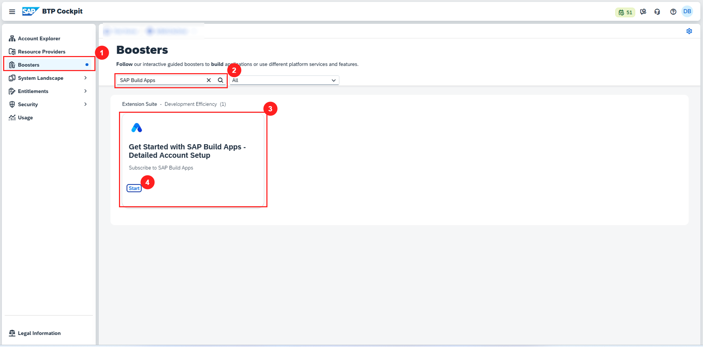

4. Verifique os pré-requisitos e clique em **Next**

5. Em **Select Scenario** escolha a opção **Select Subaccount** e clique em **Next**

    
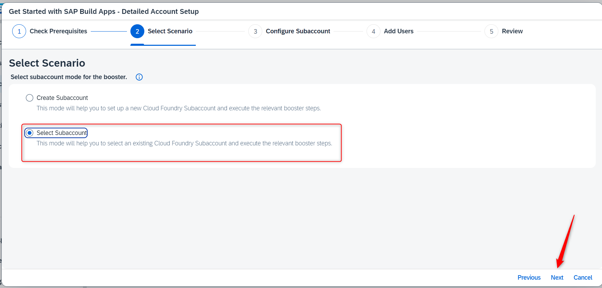

    > Nós recomendamos escolher o plano de serviço **standard** para este exercício. Para testes, o plano **free** pode ser suficiente também.

6. Para o SAP Build Apps escolha o plano **free** e o para o SAP Build Work Zone Standard Edition selecione o plano **standard**, selecione seu space and clique em **Next**

    
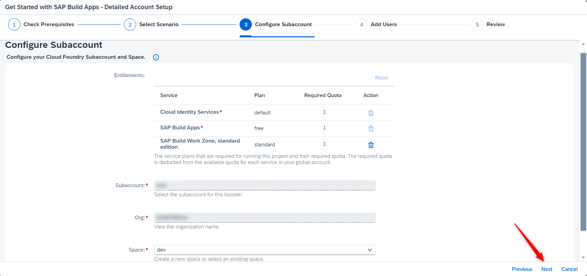

7. Adicione os e-mails dos administradores e dos desenvolvedores desejados nos campos dedicados e clique em **Next**

    
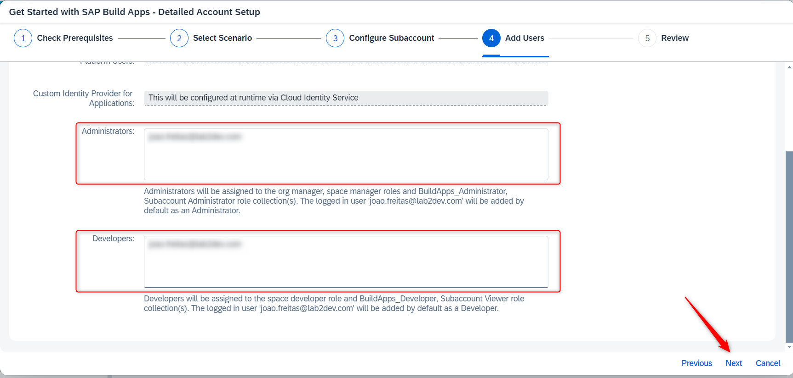

8. Revise suas configurações e clique em **Finish**

    
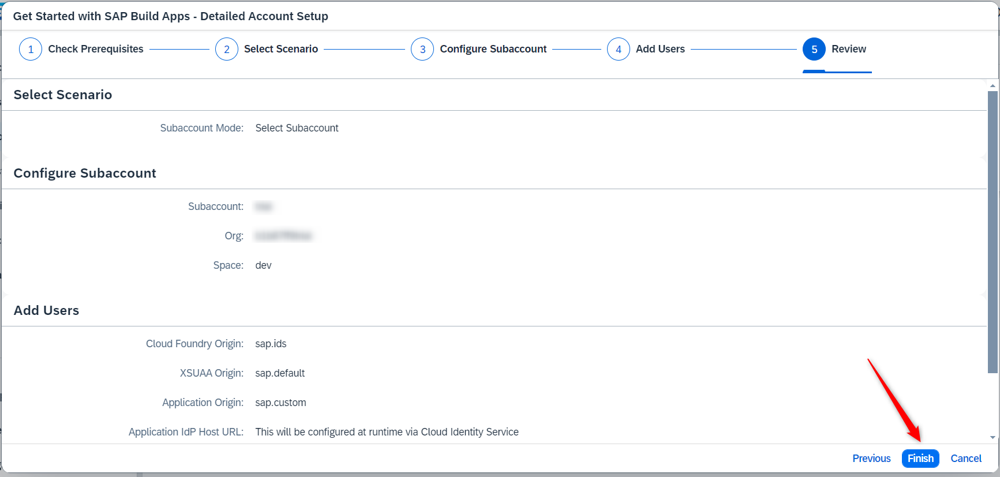

9. O booster irá criar os serviços necessários para o SAP Build Apps e SAP Build Work Zone, standard edition. Isso pode levar alguns minutos. Quando o booster estiver completo, você verá uma mensagem de sucesso. Clique na opção **Navigate to Subaccount** para ir para a subconta.

    
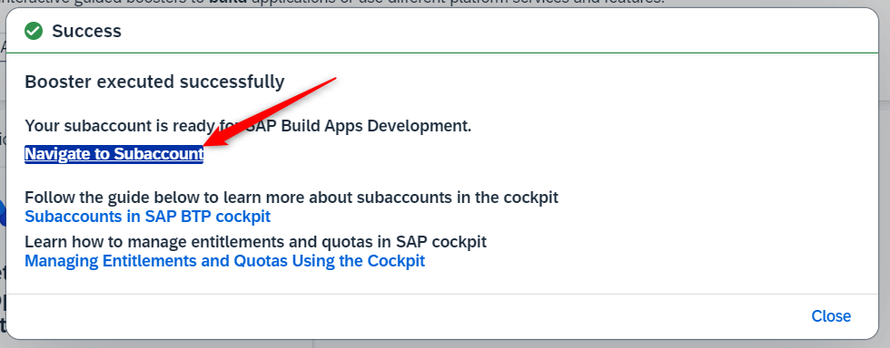

10. Após a conclusão da configuração do booster será enviando um email de ativação para do Cloud Identity Services para o usuário configurado como administrador no passo 7. Ative a conta antes de acessar o SAP Build Apps.

## Passo 2: Atribuir roles para o SAP Build Work Zone, standard edition

1. Dentro da subconta, navegue até **Security** > **Role Collections**

2. Na lista de role collection, procure **Launchpad Admin** e clique para abrir

    
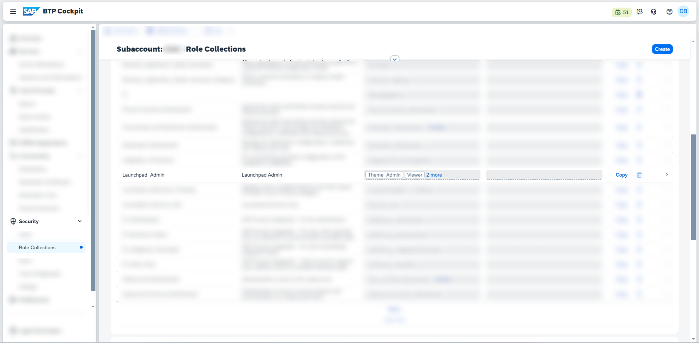

3. Escolha o botão **Editar** e role a página para baixo até a seção **Usuário**. Insira o seu endereço de e-mail e selecione **Custom Identity Provider** como **Identity Provider**. Repita o passo para todos os usuários que precisam de acesso de administrador.

4. **Save** suas alterações

    
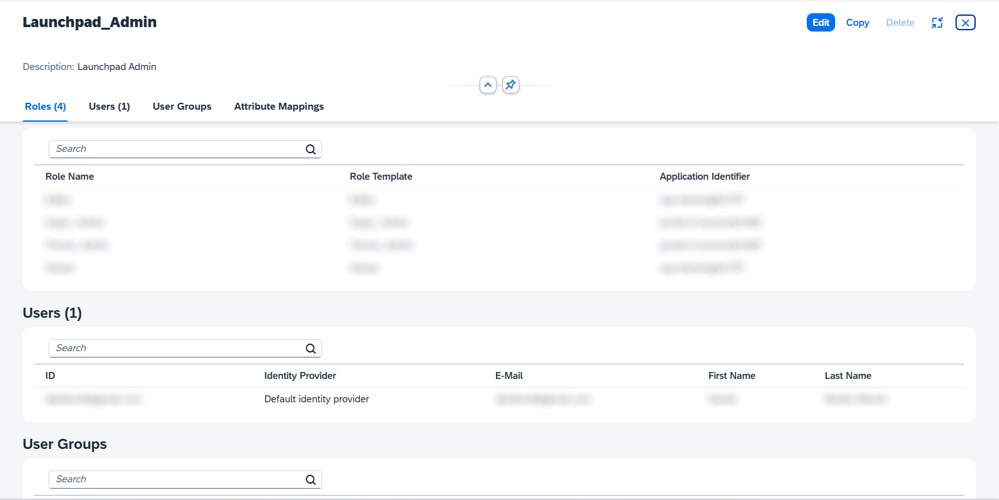

## Passo 3: Configurar destino para API do SAP Business Accelerator Hub

Para que a aplicação acesse exemplos de dados empresariais, configuraremos um destino no subaccount do BTP para a API de [Business Partner](https://api.sap.com/api/API_BUSINESS_PARTNER/overview) do ambiente de testes (sandbox) do SAP Business Accelerator Hub.

1. Com a mesma conta utilizada para acessar o BTP, ou com uma conta gratuita, acesse a API de [Business Partner](https://api.sap.com/api/API_BUSINESS_PARTNER/overview) e obtenha a URL de serviço, acessando a aba **Overview**, navegando até a área **API Resources**, e seguida na aba **Configuration Details** copie a URL do campo **SANDBOX URL**
  `https://sandbox.api.sap.com/s4hanacloud/sap/opu/odata/sap/API_BUSINESS_PARTNER`

    
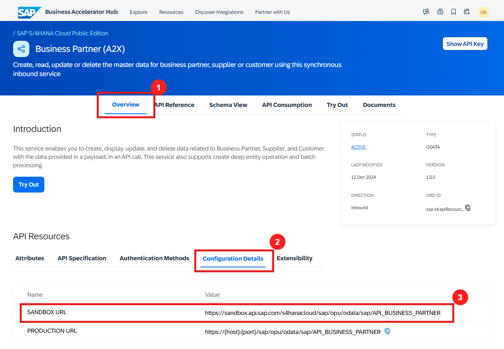

  
2. Copie a chave de API, clicando menu no canto direito superir, na opção **Settings** e no botão **Show API Key**.
    
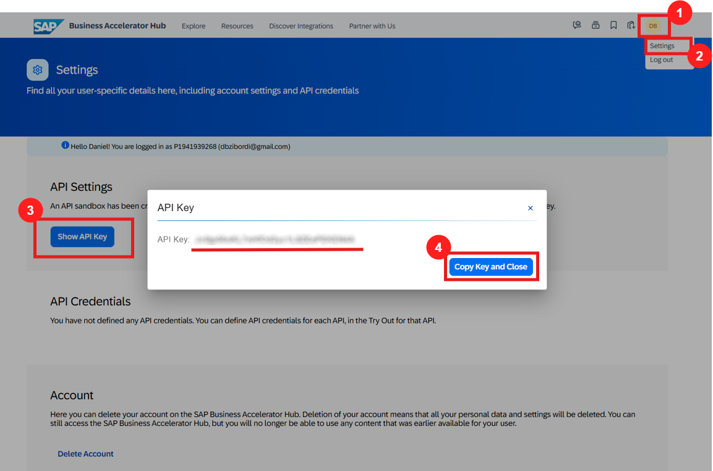

3. Voltando para no subaccount do BPT, no menu lateral esquerdo abra a opção **Connectivity**, em seguida **Destinations**, clique em **Create Destination**

     

4.  Preencha os campos indicados, adicione as seguintes propriedades e valores no destino através do botão New **Property** de depois de salve as alterações:

- Name: `DemoAPI-BP`
- URL: URL obtida no SAP Business Accelerator Hub 

| Propriedade  | Valor |
| ------------- | ------------- |
|`AppgyverEnabled` | `true`|
|`HTML5.DynamicDestination` | `true`|
|`WebIDEEnabled` | `true`|
|`sap.applicationdevelopment.actions.enabled` | `true`|
|`sap.processautomation.enabled` | `true`|
|`URL.headers.APIKey` |chave de API gerada no SAP Business Accelerator Hub|

  
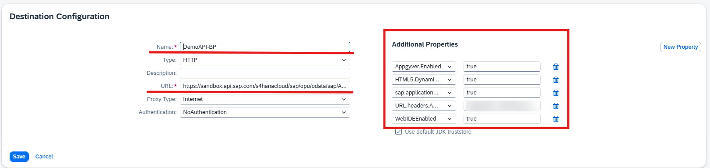

## Parabéns!

Incrível! Você completou o Exercício 0 para os pré-requisitos. 🥳

Agora você é capaz de ver tanto o **SAP Build Apps** quanto o **SAP Build Work Zone, standard edition** em sua subconta BTP em **Instances and Subscriptions**. Usando o ícone de janela pequena você pode acessar a aplicação para trabalhar com eles.

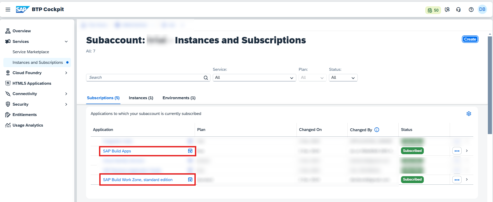

Você pode voltar para a página [Overview](../../#exercises).  
Ou você pode seguir para o próximo exercício [Exercise 1](../ex1/), navegue para lá clicando no link [neste link](../ex1/).

## Problemas comuns

### SAP Build Apps com SAML Identity Provider

SAP Build Apps necessita de um tenant do SAP Identity Authentication Service conectado via OpenID Connect (OIDC) à subconta do SAP BTP usando a funcionalidade **Establish Trust**.

### IAS tenant não aparece em Establish Trust

O SAP Identitiy Authentication Service Tenant só aparece em **Establish Trust** quando ambos estão atribuídos ao mesmo customer id.

See [SAP Help](https://help.sap.com/docs/btp/sap-business-technology-platform/establishing-trust-automatically?version=Cloud&locale=en-US) para mais informações.
