# Criando sua primeira aplicação com SAP Build Apps

## Introdução

Nesta seção, você irá criar uma nova aplicação usando o SAP Build Apps.

## Pré-requisitos

- Ter completado o exercício anterior e as etapas de configuração.

## Passo 1: Iniciar o SAP Build Apps

1. Abra sua **SAP BTP subaccount**.

2. No menu lateral da sua subaccount, navegue para **Services → Instances and Subscriptions**.

3. Na aba **Subscriptions**, procure **SAP Build Apps** e escolha **Go to Application** para abrir a página de  desenvolvimento de aplicativos.

    
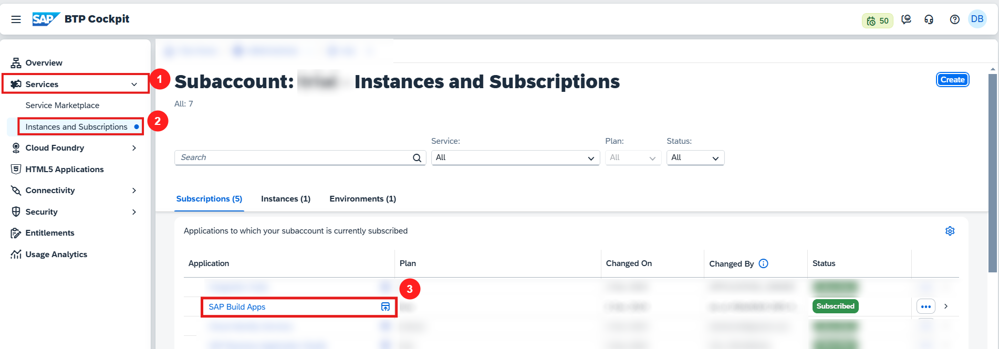

4. Entre na aplicação usando suas credenciais de provedor de identidade.    

## Passo 2: Criando uma aplicação usando SAP Build Apps

**Criando um projeto**

1. No Lobby do SAP Build ,selecione a opção **Create** e escolha **Build an Application**.

    
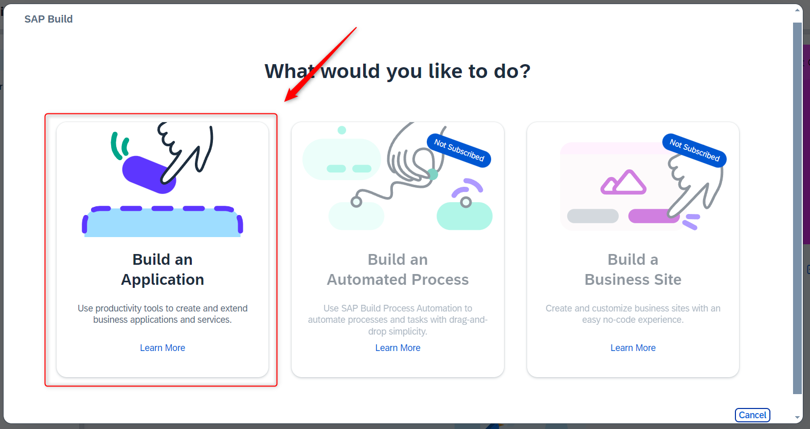

2. Escolha a opção **SAP Build Apps**

    
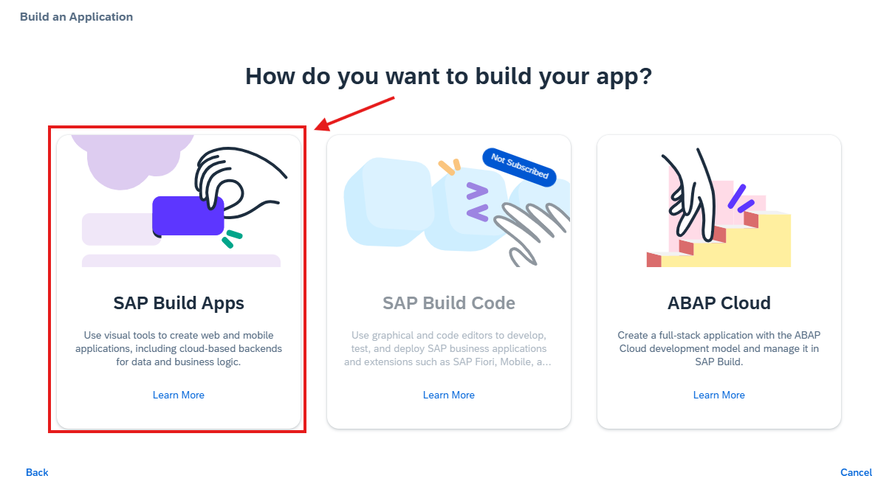

3. Escolha **Web & Mobile Application**.

    
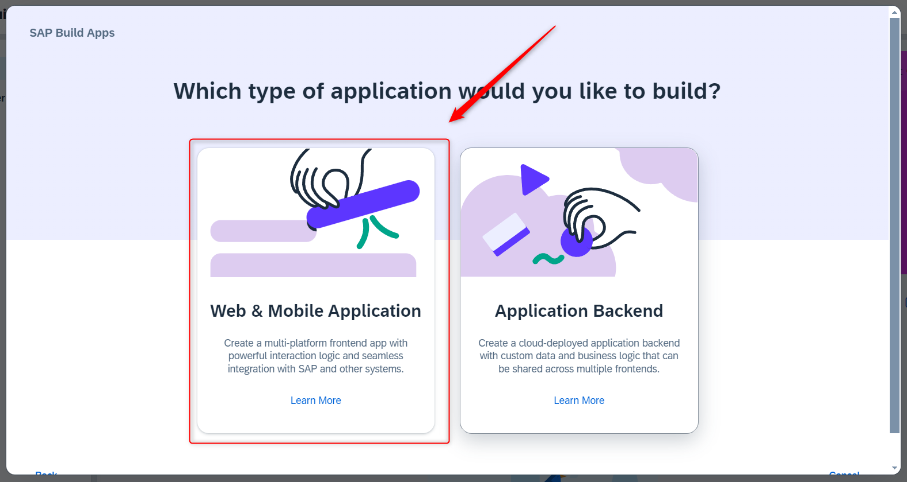

4. Defina um nome para o projeto no seguinte formato ``BTP_EXP_##`` onde **##** é um identificador único como um número de inscrição ou o seu nome, por exemplo, `BTP_EXP_01`.

5. Você pode adicionar uma descrição curta no campo **Description** mas esse campo não é obrigatório.

6. Selecione a opção **Create**.

    
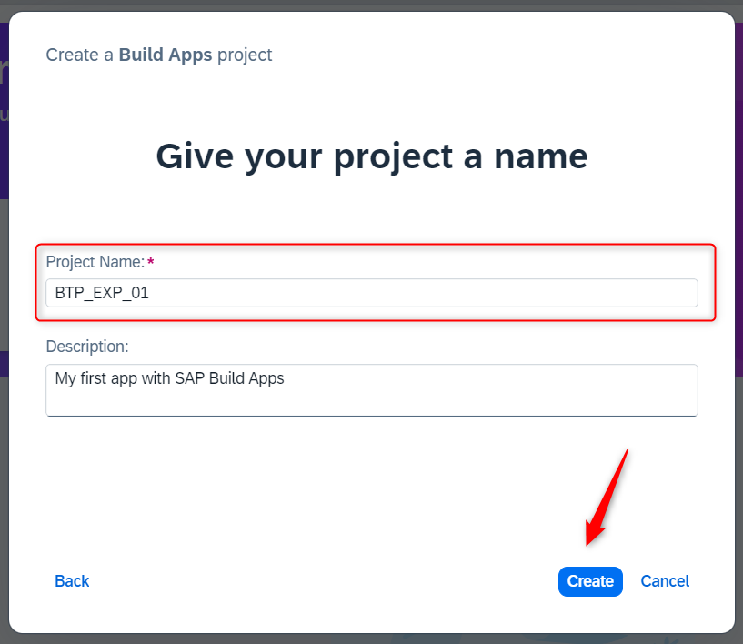

7. O Projeto criado será aberto no **App Builder** que é a página central para construir sua aplicação incluindo a interface do usuário, lógica e integração de dados.

8. Selecione **Headline**.

9. Procure a aba **Properties** no menu à direita para alterar o conteúdo do título. Escolha **Content** e altere o conteúdo de **Headline** para `Meus Parceiros de Negócios`.

    
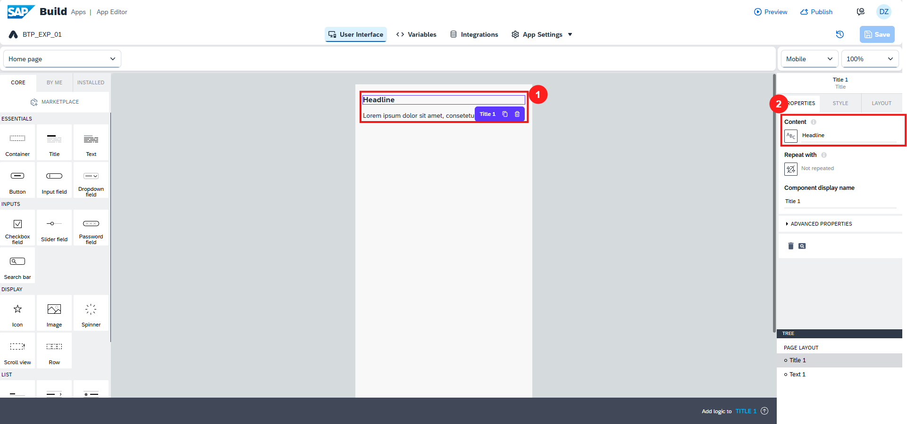

10. Procure o campo de texto no centro da tela e remova o componente.

    
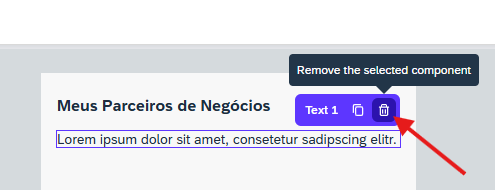

11. Clique na página em branco. Depois no lado direito, em **Properties**, escolha **Page name**.

12. Altere o nome da página para `Home`.

    
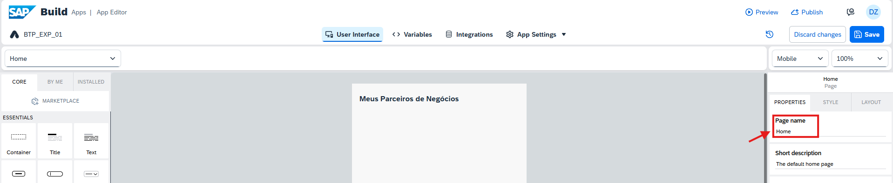

## Passo 3: Habilitando autenticação

Para consumir dados de um sistema SAP backend ou mock data que são configurados como uma destination SAP BTP, você precisa habilitar a autenticação.

1. Clique na aba **App Settings** no topo do App Builder e depois em **Authentication**.

    
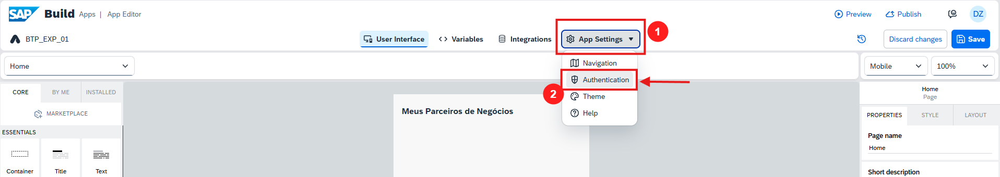

  

2. Clique em habilitar autenticação.

    

     

3. Selecione **SAP BTP Authentication** e clique em **OK**. Isso habilita a autenticação para o projeto.

## Passo 4: Adicionando uma fonte de dados local

Para adicionar uma fonte de dados local você precisa seguir os seguintes passos:

1. Clique na aba **Integration** no topo do App Builder.

2. Procure a seção **No system integrated** e clique na opção  **ADD INTEGRATION**.

    
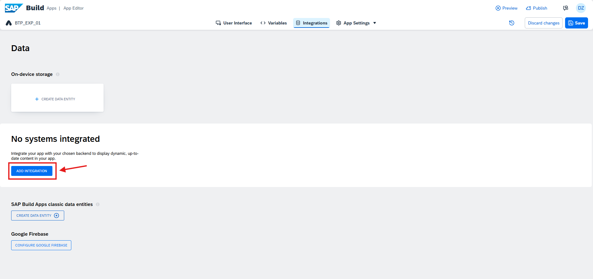

3. Na próxima tela, selecione **BTP Destinations**.

4. Pesquise e selecione a destination `DemoAPI-BP`.

    
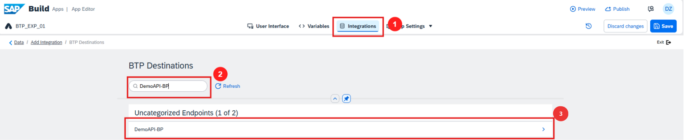

5. Clique em instalar integração.

6. Pesquise pela entidade de dados **A_BusinessPartner** e clique no botão **Enable Data Entity**.

    
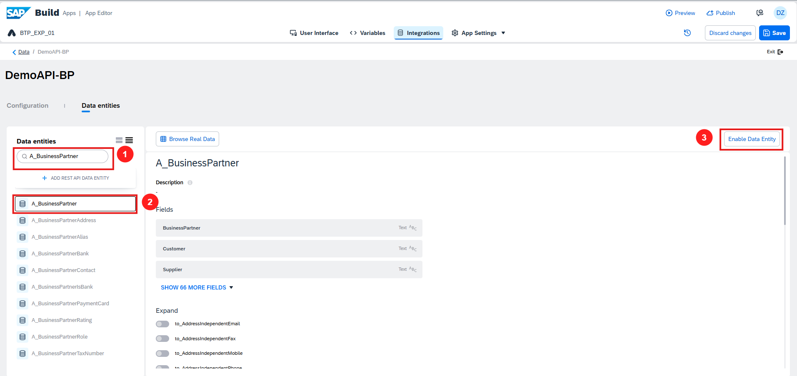

7. Agora, procure por **A_BusinessPartnerAddress** e escolha **Enable Data Entity** também.

8. Repita o mesmo para **A_AddressPhoneNumber**.

9. Escolha **Save** no topo do app builder. Isso adiciona a fonte de dados ao seu projeto. 

10. Agora você adicionou uma fonte de dados para sua aplicação SAP Build Apps.

## Passo 5: Criando uma página de lista de parceiros de negócios

Para criar uma página exibindo a lista de parceiros de negócios, você precisa primeiro criar **data variable**.

**Data Variable**

Um data variable é essencialmente a mesma coisa que uma page variable que existe no contexto da página atual e não é acessível de outras páginas, e desaparece se a página for removida de navegação. A diferença é que ela obtém seu esquema do recurso de dados ao qual aponta e vem com a lógica padrão incluída.

### **Criando um Data Variable**

Vamos criar um data variable para armazenar os resultados dos dados do parceiro de negócios provenientes da fonte de dados.

1. Na aba **Variables**, escolha **DATA VARIABLES**.

2. Agora, escolha **ADD DATA VARIABLE** e selecione **A_BusinessPartner**.

    
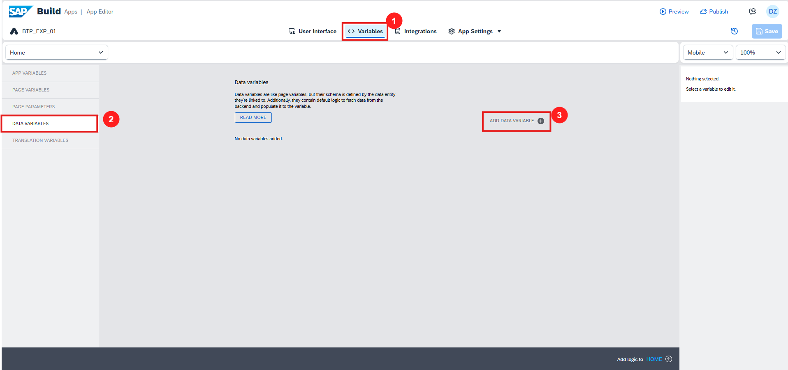

4. Altere o campo **Data variable name** para `BusinessPartner`

   
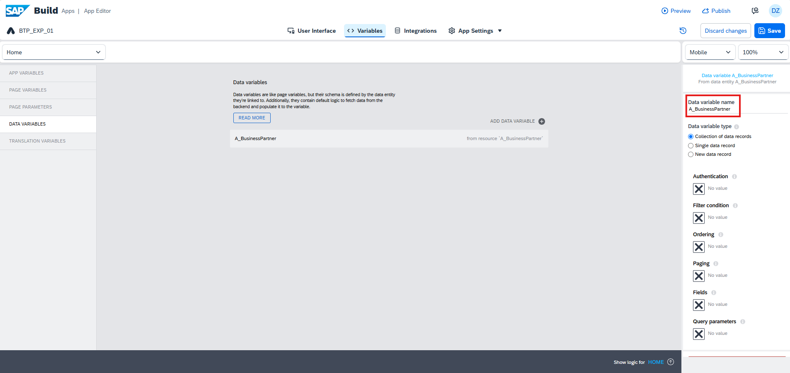

5. Clique em **SAVE**.

### **Limitando quantidade de registros da API**

1. Agora que a data variable foi criada, para efeito de testes do exercício, vamos incluir um limitador de quantidade de registros na seleção dos dados da API.
   
2. Na opção **Paging** clique no "X" para modificar o binding.
   
      
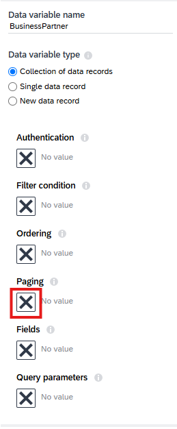

      
3. Selecione a opção **Object with properties**
    
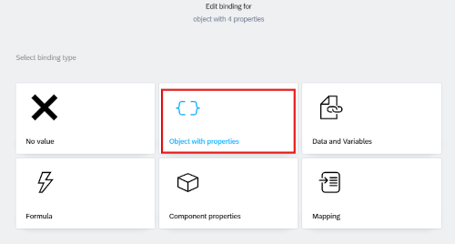

    
4. Na opção do **Page size** determine o binding **Static number**, preencha com o valor `10` e salve.
    
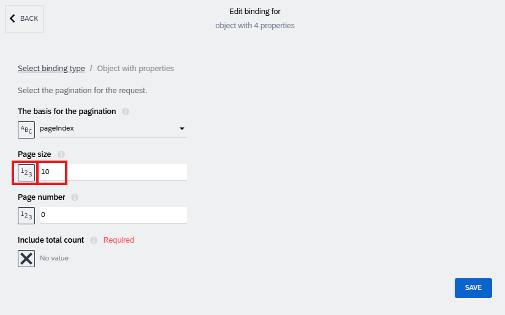

### **Criando uma página de lista de parceiros de negócios**

Neste passo você irá criar uma página de lista de parceiros de negócios no app builder.

**Verifique se os dados estão visíveis na interface do usuário**

1. Na aba **User Interface**, você verá a guia **CORE**, role para a seção **LISTS** e escolha **List item**.

    
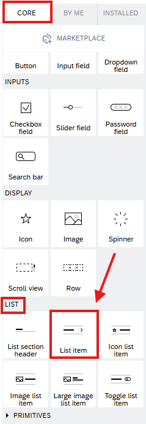

2. Arraste o **List item** para a página da aplicação.

3. No lado direito, na seção **PROPERTIES**, role para **Repeat with** e clique no botão para fazer o bind.

    

4. Um popup será aberto. Selecione **Data and Variables**, então escolha **Data variable**.

    
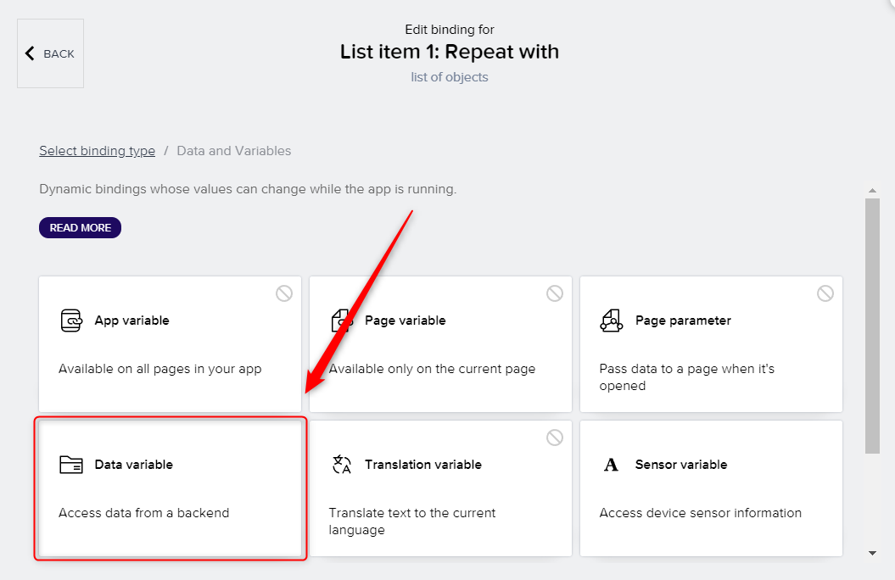

5. Selecione **BusinessPartners** na lista e clique em **SAVE**.

6. Você configurou que a lista é populada com a variável de dados que obtém os dados do parceiro de negócios.

### **Selecionando os campos de exibição para a lista**

Agora vamos definir quais campos gostaríamos de exibir na interface do usuário na lista de parceiros de negócios.

1. Selecione a lista.

2. Vá para **PROPERTIES**.

3. Clique no botão do campo Primary Label **ABC**.

    
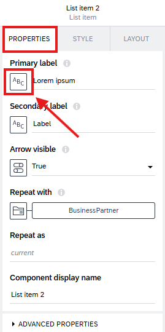

4. Selecione a opção **Data item in repeat**.

5. Selecione a opção **current**.

6. Selecione a opção **BusinessPartnerName**

7. Digite `Business Partner Name` no campo **Set preview value** e clique em **SAVE**.

    
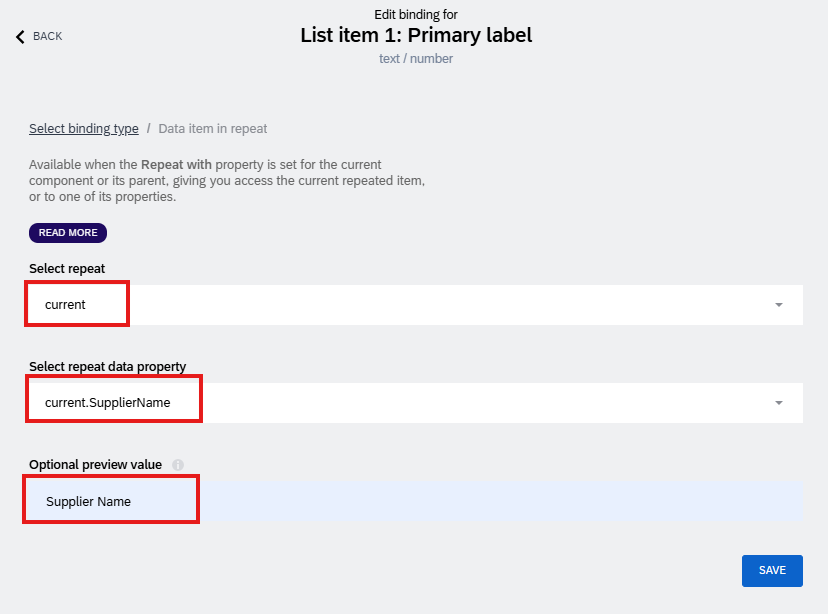

8. Vá para **PROPERTIES**.

9. Clique no botão do campo Secondary Label **ABC**.

10. Selecione a opção **Data item in repeat**.

11. Selecione a opção **current**.

12. Selecione a opção **BusinessPartner**

13. Digite `Id` no campo **Set preview value** e clique em **SAVE**.

    
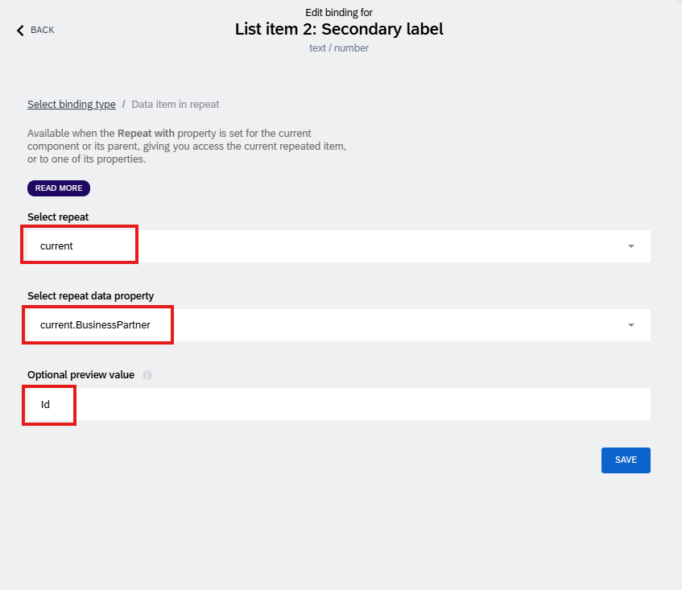

## Passo 6: Pré-visualização da aplicação

1. Clique no botão **Preview**.

2. Clique no botão **Open web preview**.

3. Selecione o aplicativo que você acabou de criar e clique em **Open preview**. 

4. O aplicativo será exibido no portal de pré-visualização.

    
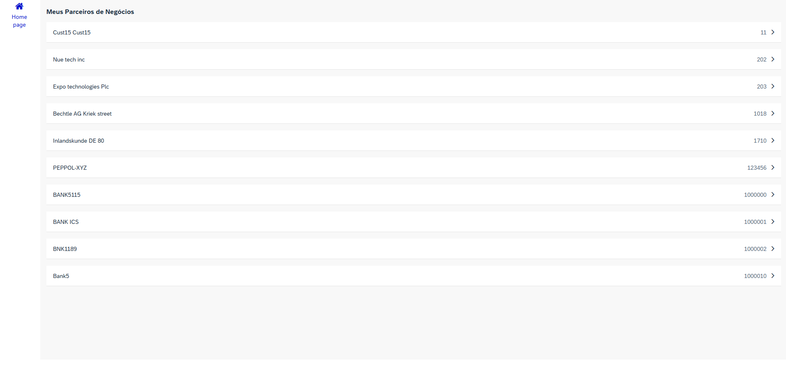

Agora você pode visualizar a lista de parceiros de negócios que você acabou de criar.

## Parabéns!

Incrível! Você completou o Exercício 1. 🥳

Você pode voltar para a página Overview [Overview](../../#exercises).  
Ou você pode seguir para o próximo exercício [Exercise 2](../ex2/), navegue para lá clicando no link [this link](../ex2/).
