# Faça o Build da sua Aplicação

## Introdução

Nesta seção, você fara o build da aplicação que você criou usando o SAP Build Apps, e então implantá-la no SAP BTP como uma aplicação HTML5.

## Pré-requisitos

- Você deve ter completado os exercícios anteriores
- Seu SAP Build App está funcionando e pronto para ser implantado

## Passo 1: Build da aplicação

1.	Clique no botão **Publish** e em seguida em **Create a Release Version**

   
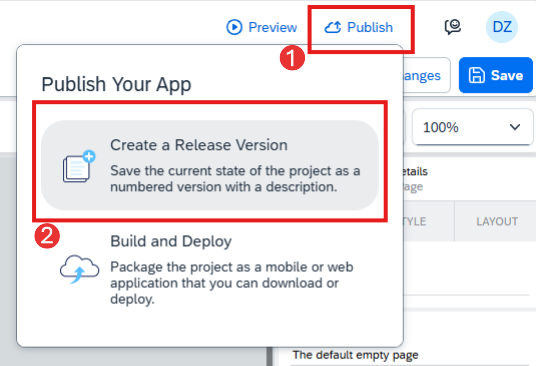

2.	Gere a versão 1.0.0 clicando em **Release 1.0.0**

   
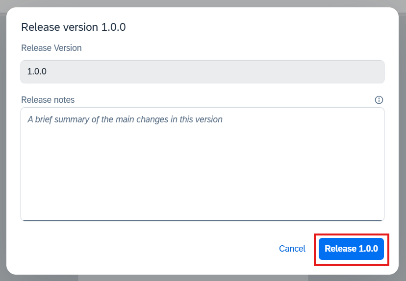

3.	Em seguida clique no botão **Open**

   
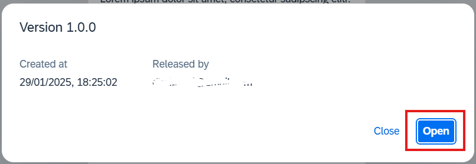

4.	Clique novamente botão **Publish** e agora em **Build and Deploy**

   
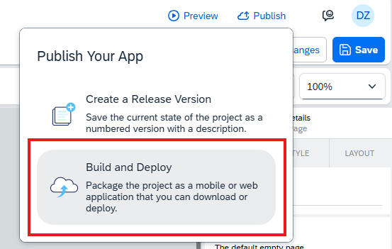

5.	Na tela que será aberta clique em **Create Configuration**

   
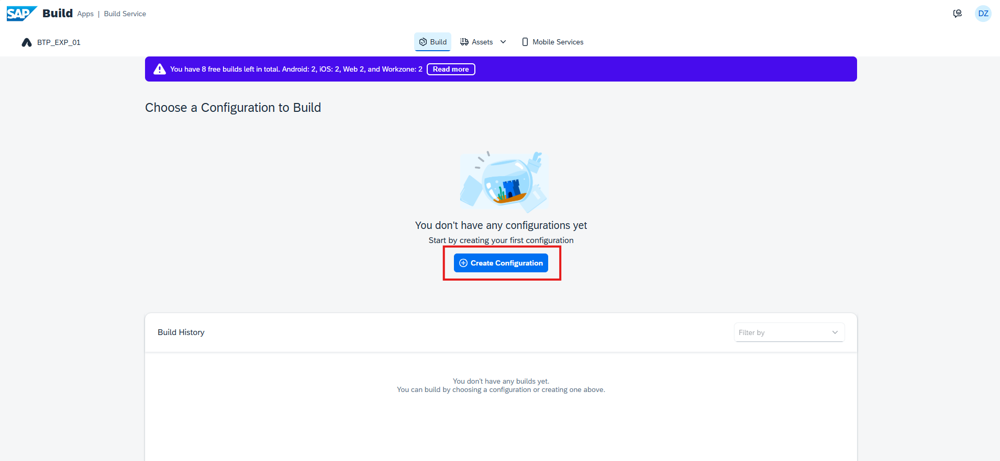

6.	Em seguida escolha a opção **SAP Build Work Zone**
 
   
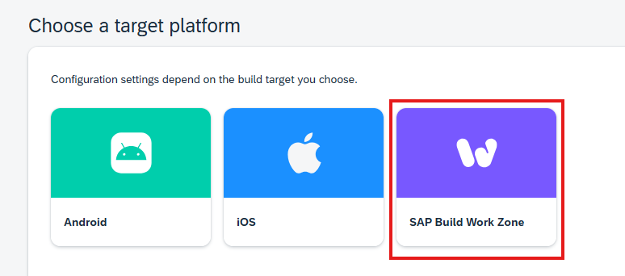

7.	Preencha o campo **Name of Configuration** com `BTP_EXP_01` e em seguida clique em **Create**
 
   
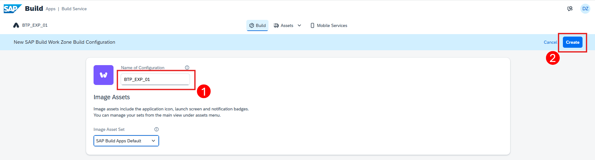

8.	Clique nos três pontos **...** da configuração que foi criada e em seguida na opção **Build**
 
   
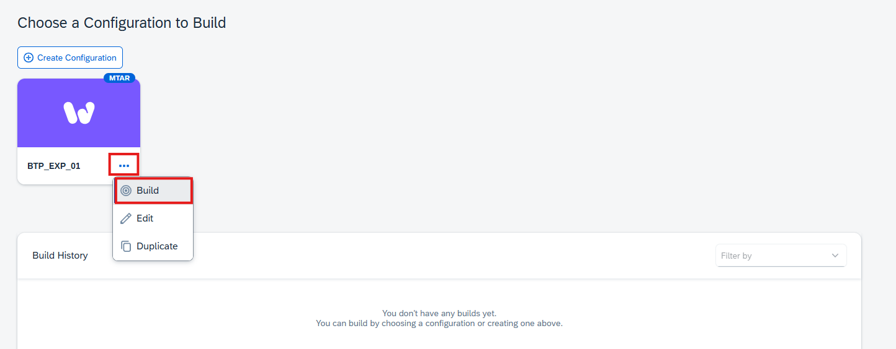

9.	No pop-up que será aberto escolha a versão **1.0.0** do Release que criou do aplicativo e preencha a versão para o build com `1.0.0` e depois clique em **Build**

    
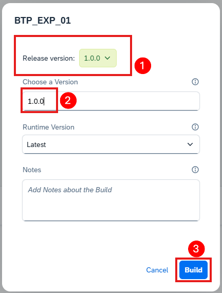

10.	Aguarde a criação do build até o status ficar **Delivered**, então clique na linha do build 
 
   
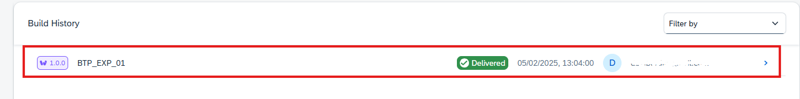

11.	Na tela que foi aberta clique em **Deploy**
 
   
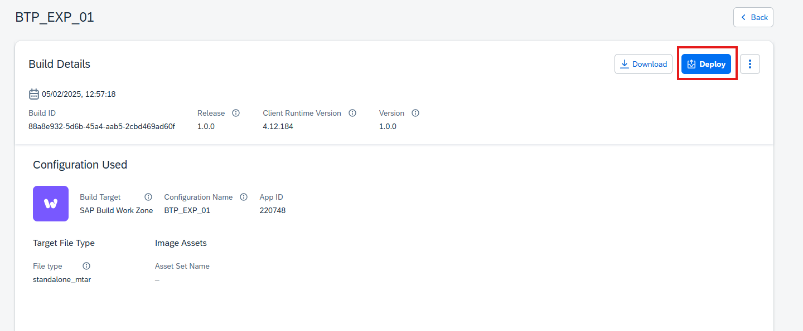

12.	No pop-up que será aberto escolha o endpoint em que seu BTP foi criado, faça o login, escolha a Organization, o Space e em seguida clique em **Continue**
 
   
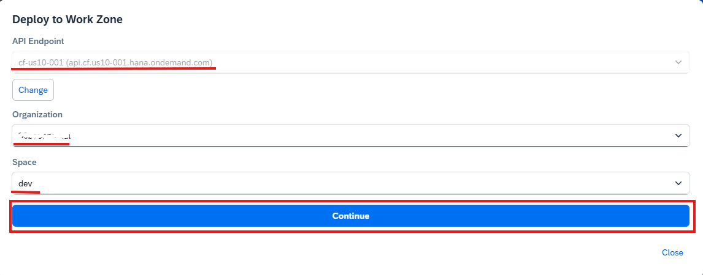

13.	Essa etapa do deploy pode levar alguns minutos, aguarde a finalização do deploy e ao final será gerado o link do endpoint do aplicativo gerado. Depois, pode clicar em **Close**
 
   
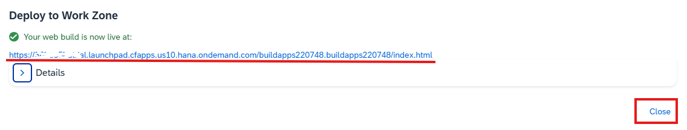

14.	O mesmo link do aplicativo poderá ser acessado pelo menu **HTML5 Aplication**s na tela do **Subaccount**

   
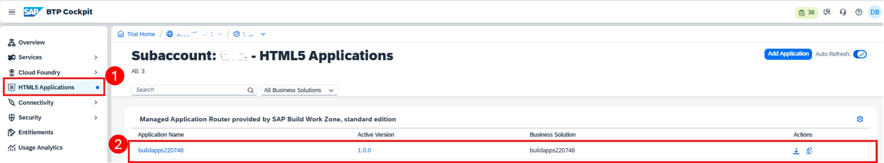

## Parabéns!

Você completou o build da aplicação que você desenvolveu no SAP Build Apps.

Incrível! Você completou o Exercício 3. 🥳

Você pode voltar para a página Overview [Overview](../../#exercises).  
Ou você pode seguir para o próximo exercício [Exercise 4](../ex4/), navegue para lá clicando no link [this link](../ex4/).
