# Integre seu aplicativo com o SAP Build Work Zone, standard edition.

## Introdução

Nesta seção, o aplicativo será conectado com o SAP Build Work Zone, standard edition. Isso permite ter um ponto de entrada central para utilizar os aplicativos no SAP BTP.

## Pré-requisitos

- Concluiu os exercícios anteriores
- Seu SAP Build App foi criado com sucesso

## Etapa 1: Integre seu aplicativo com SAP Build Work Zone, standard edition

1. Na sua Subaccount, abra o menu lateral **Services**, depois escolha **Instances and Subscriptions** e abra o **SAP Build Work Zone, standard edition**
   
    
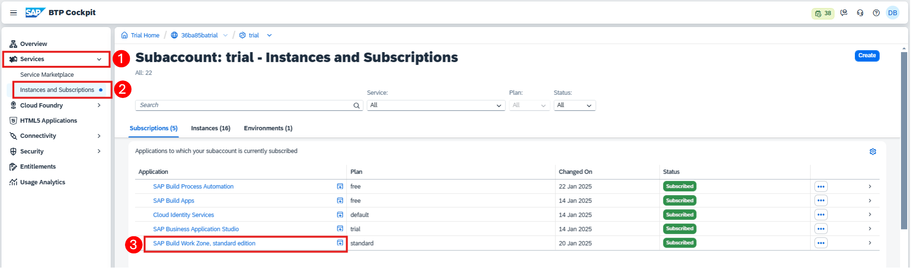
   

2. Na tela que foi aberta, no menu do lado esquerdo, escolha o ícone do **Gerenciador de canais** e depois clique no ícone de atualização para buscar o conteúdo atualizado.

    
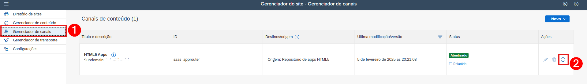
   

3. No menu lateral escolha **Gerenciador de conteúdo** e depois em  **Explorador de conteúdo**.
   
    
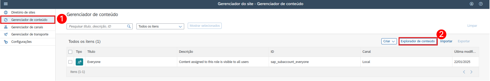
   

4. Selecione o bloco **HTML5 Apps** do seu respectivo de subdomínio.

    
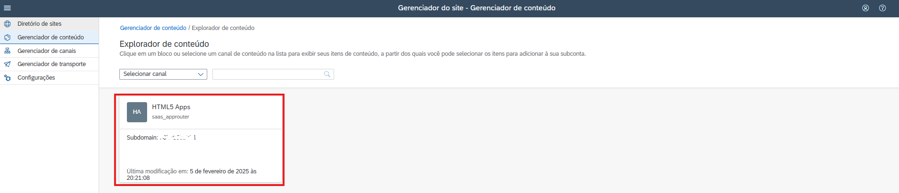
   

5. Procure pelo aplicativo com o nome criado no Build Apps `BTP_EXP_01`, marque a caixa de seleção e selecione o botão **Adicionar** .

    
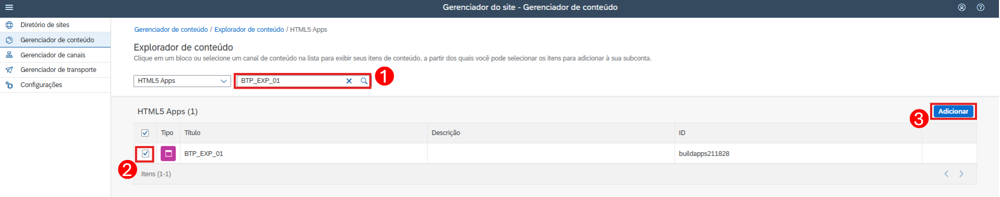
   

6. No menu lateral abra novamente o **Gerenciador de conteúdo**, clique no botão **Criar** e selecione **Grupo** no menu suspenso.
   
    
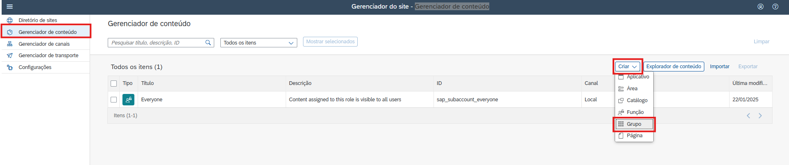
   

7. Insira o nome do grupo `Apps do XP161_01`, procure pelo aplicativo `BTP_EXP_01` que foi adicionado anteriormente no Gerenciador de Conteúdo, mude o campo **Status de Atribuição** conforme abaixo e clique em **Salvar**:

    
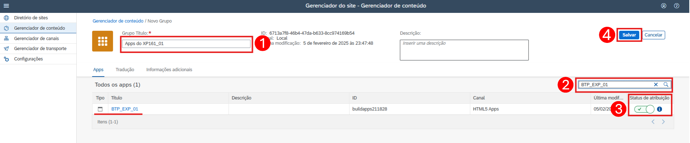
   

8. No menu lateral abra novamente o **Gerenciador de conteúdo**, clique no botão **Criar** e selecione **Função** no menu suspenso.

    
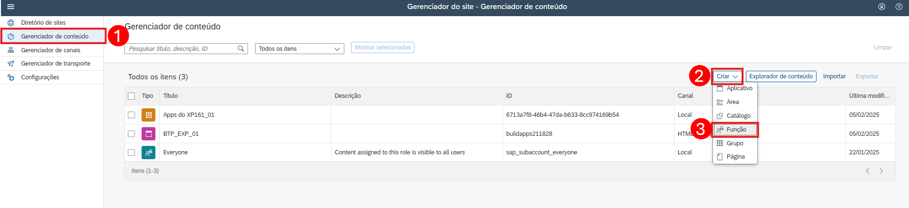
   

9. Insira o nome da função `XP161_01`, procure pelo aplicativo `BTP_EXP_01` que foi adicionado anteriormente no Gerenciador de Conteúdo, mude o campo **Status de Atribuição** conforme abaixo e clique em **Salvar**:

    
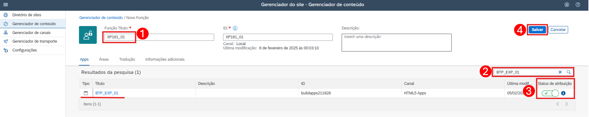
   

10. No menu do lado esquerdo navegue até **Diretório de Sites** e no bloco clique no botão **+ Criar site**

    
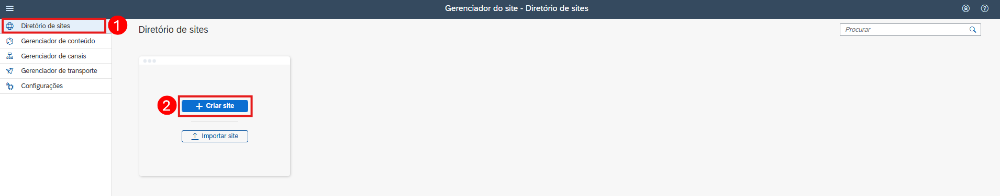
   

11. Preencha o campo Nome do site do pop-up com `XP161_01` e clique em  **Criar**

    
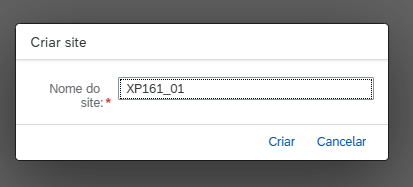
    

12. Agora, você será encaminhado para o editor do site. Clique em **Editar**, procure a função `XP161_01` na coluna da direita, clique no botão **+** e depois em **Salvar**

    
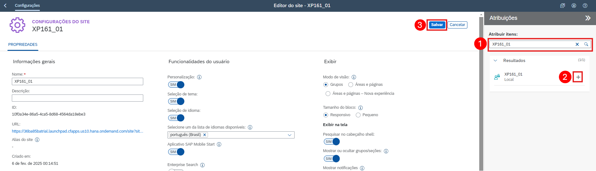
    

## Etapa 2: Habilitando a Autenticaçãoe e Atribuição das Permissões

1. Iremos habilitar o serviços de identidade em nuvem para o Work Zone.
    No menu lateral abra novamente o **Configuração**, clique na aba **Identity Authentication**, marque o checkbox e depois clique em **Ativar**

    
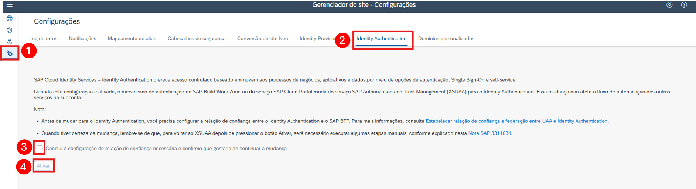
          

2. Agora atribuiremos a role que foi criada no Work Zone no nosso usuário.
   Volte no subaccount do BTP, abra o menu **Security**, depois **Role Collection**. Em seguida, pesquise pela função `XP161_01` que havia sido criada no Work Zone e clique sobre ela para abrir os detalhes do lado direito. Então clique em **Editar** e desça até a área da tela **Users**. Adicione seu email no campo **ID** e no campo **Identity Provider** selecione a opção `Custom IAS tenant`. E salve a altereção.

    
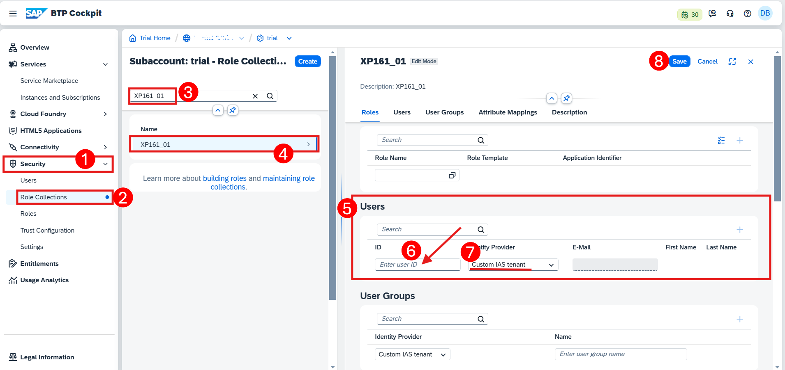
     

## Etapa 3: Testando seu aplicativo no Workzone

1. Retorne ao SAP Build Work Zone e no menu do lado esquerdo navegue novamente até **Diretório de Sites**, mas agora  clique no pequeno ícone **Acessar o site** do site que havia sido criado anteriormente.

    
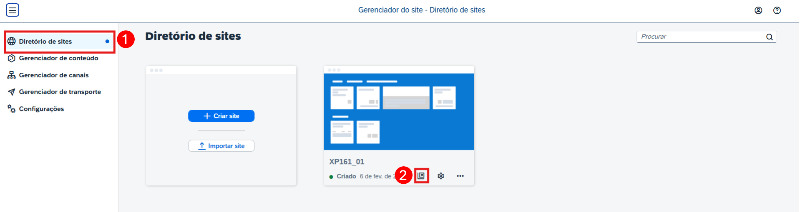
          

15. Nessa etapa você deve conseguir visualizar o seu aplicativo que foi desenvolvido na seção definida, abri-lo e navegar entre as páginas criadas.

    
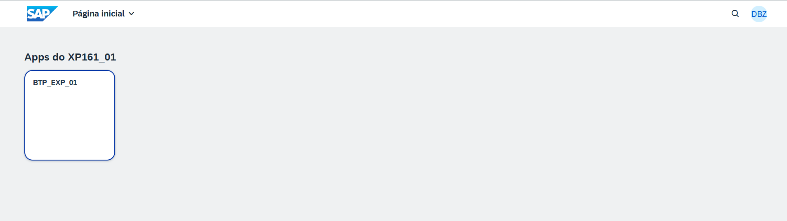
     

## Parabéns

Você arrasou! Você completou o Exercício 4. 🥳

Parabéns! Agora você concluiu o desenvolvimento do seu aplicativo. Nesta última etapa, você integrou seu aplicativo no SAP Build Work Zone, standard edition, 

Você pode voltar para a página [Overview](../../#exercises).  
