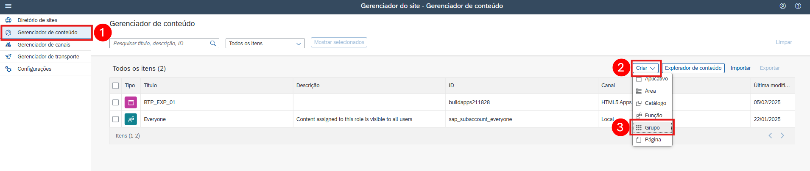

# Integre seu aplicativo com o SAP Build Work Zone, standard edition.

## Introdução

Nesta seção, o aplicativo será conectado com o SAP Build Work Zone, standard edition. Isso permite ter um ponto de entrada central para utilizar os aplicativos no SAP BTP.

## Pré-requisitos

- Concluiu os exercícios anteriores
- Seu SAP Build App foi criado com sucesso

## Etapa 1: Integre seu aplicativo com SAP Build Work Zone, standard edition

1. Na sua Subaccount, abra o menu lateral **Services**, depois escolha **Instances and Subscriptions** e abra o **SAP Build Work Zone, standard edition**
   
       

2. Na tela que foi aberta, no menu do lado esquerdo, escolha o ícone do **Gerenciador de canais** e depois clique no ícone de atualização para buscar o conteúdo atualizado.

       

3. No menu lateral escolha **Gerenciador de conteúdo** e depois em  **Explorador de conteúdo**.
   
       

4. Selecione o bloco **HTML5 Apps** do seu respectivo de subdomínio.

       

5. Procure pelo aplicativo com o nome criado no Build Apps `BTP_EXP_01`, marque a caixa de seleção e selecione o botão **Adicionar** .

          

...
   

8. In the items table, search for your application by its name `XP161_##` (using your number) or the application id and set the checkmark. Choose the button **Add** afterwards.

       

9. Go back to the root page of the **Content Manager** by clicking the link above the headline **Content Explorer**. Click the **Create** button and  select **Group** from the dropdown.

    

10. Add the title `Apps of XP161_##` replacing `##` with your participant number.

11. Search for your application name `XP161_##` at the top left and tick the assignment status toggle.

    > **Please note:** You may see a lot of other content before searching. Just ignore it

12. Choose **Save**.

    

13. Back in the **Content Manager**, search for the role `XP161_##` (replacing `##` with your number) and click on the row with your role. Click the **Edit** button.

     

14. Search for your application name using `XP161_##` (using your number) at the top left and tick the assignment status toggle.

15. Click **Save**.

    

16. In the menu on the left side navigate to **Site Directory.**

17. Choose button **Create Site.**

    

18. Enter `XP161_##` (replacing `##` with your number) as name for the site and choose **Create.**

19. Now, you are forwarded to the site editor. Click **Edit**.

    Search for your role `XP161_##` (using your number) on the right column and click the **+** button.

    

20. Repeat this for the role `Purchaser` and select the one with the subtitle `S/4HANA`.

    

21. Click **Save**.

22. Go back to the Site Directory and find your created site. Open it by choosing the small **Go to site** icon.

    

23. You should be able to see your app in its defined section

    

## Step 2: Use your app in SAP Mobile Start

1. On your Site and select **Settings** from your **profile icon**

    

2. Go to **SAP Mobile Start** in the settings and select your **platform** and the **Register tab**

    

4. Open your SAP Mobile Start app, **agree** to the EULA and Privacy statements and **scan** the QR-Code

    

    

5. Enter your user credentials to login

    

6. Find and open your app in SAP Mobile Start

    

    

## Congrats

You Rock! You completed Exercise 4. 🥳

Congratulations! You now have finished the development of your application. In this last step you have integrated your app in SAP Build Work Zone, standard edition, to have one central entry point to show all of your SAP BTP applications. Finally, you have have opend your app in SAP Mobile Start.

You can now navigate to the [Overview](../../#exercises).  
